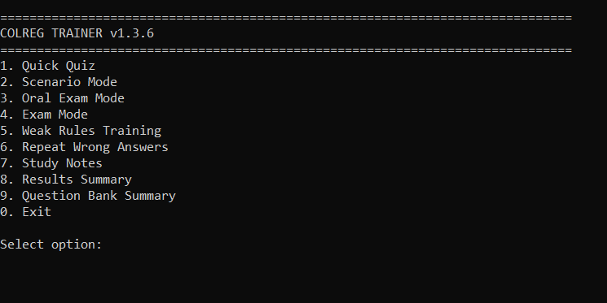
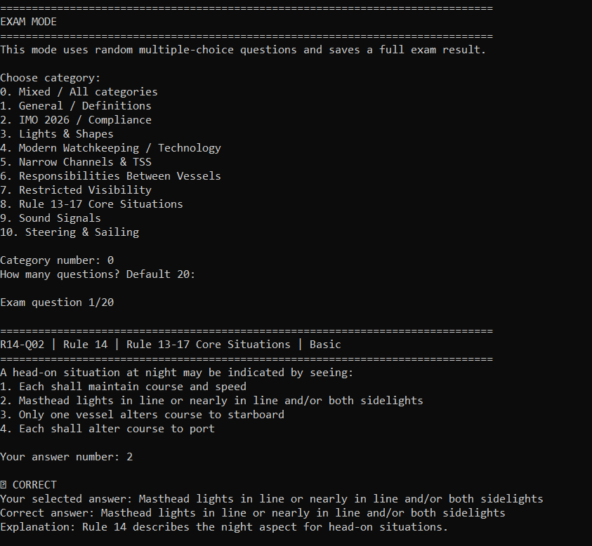
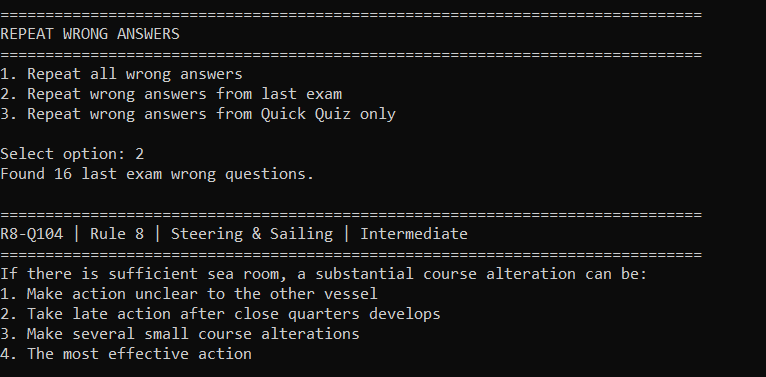
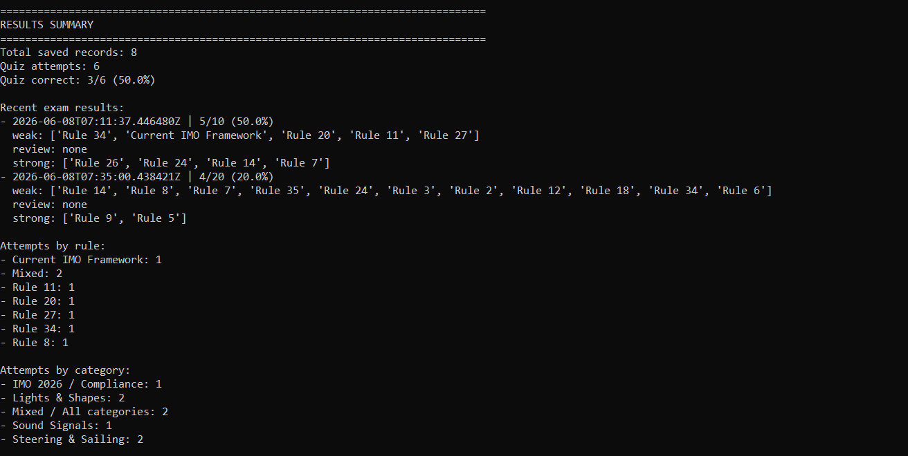

# COLREG AI Trainer

AI-assisted COLREG training app for cadets, OOW officers, Chief Officers, and maritime professionals.

## Overview

COLREG AI Trainer is a Python-based learning and exam-preparation tool for the International Regulations for Preventing Collisions at Sea.

The project is designed to help users study COLREG rules through quizzes, scenarios, oral exam practice, weak-rule tracking, and repeated wrong-answer training.

## Current Version

Development version: v1.3.6

Status: Testing and quality improvement

## Main Features

- Quick Quiz mode
- Scenario training
- Oral exam mode
- Exam mode
- Weak rules tracking
- Repeat wrong answers
- Study notes
- Results summary
- Question bank summary
- Difficulty levels: Basic, Intermediate, Advanced

## Screenshots

### Main Menu

### Exam Mode

### Repeat Wrong Answers

### Results Summary

## Training Areas

- General definitions
- Look-out
- Safe speed
- Risk of collision
- Action to avoid collision
- Narrow channels
- Traffic separation schemes
- Overtaking
- Head-on situations
- Crossing situations
- Give-way and stand-on vessels
- Responsibilities between vessels
- Restricted visibility
- Lights and shapes
- Sound signals
- IMO compliance background

## Project Purpose

This project is for maritime education, exam preparation, and professional knowledge refresh.

It is not a substitute for official COLREG publications, bridge procedures, company SMS, flag-state requirements, or professional judgement at sea.

## Roadmap

- v1.4: Question bank quality review
- v1.5: Better progress tracking
- v1.6: Export study reports
- v2.0: Web app version
- v3.0: Commercial learning product

## Disclaimer

For training and educational use only.

Always refer to official COLREG text, company procedures, flag-state requirements, and good seamanship.